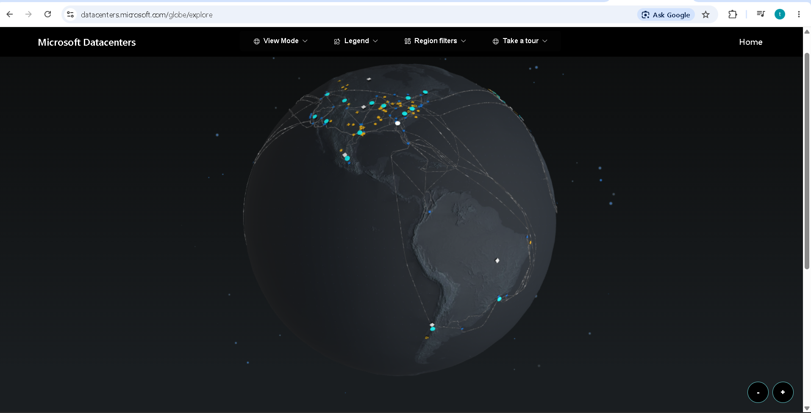
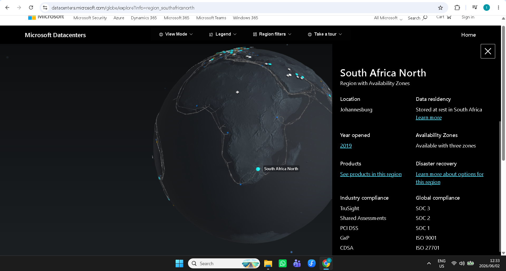
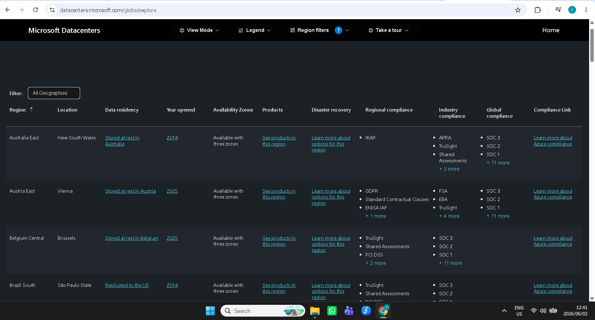
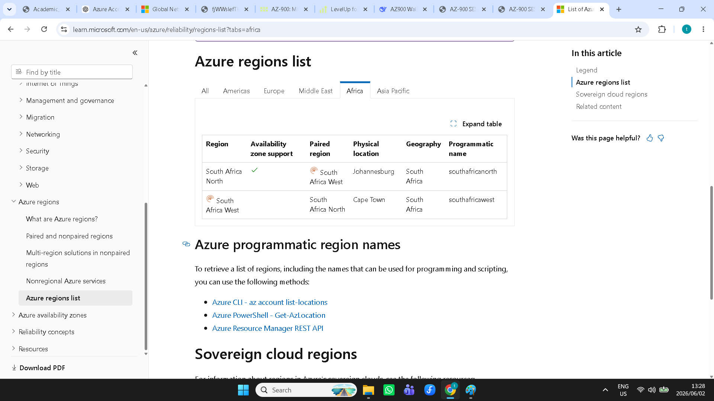
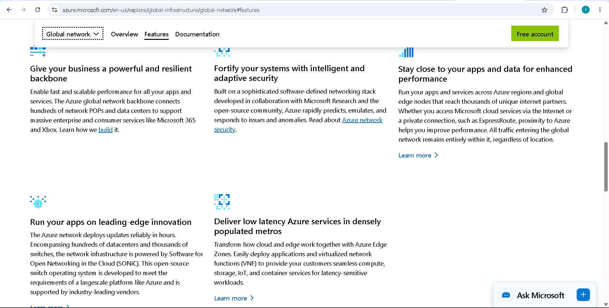
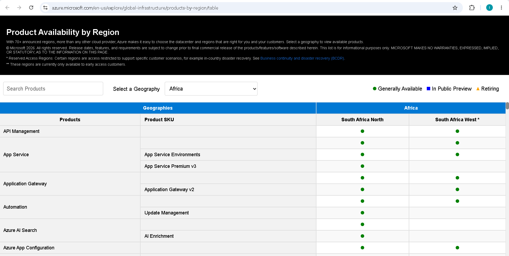

# AZ-900 Lab 02 – Exploring Azure Global Infrastructure

## Introduction

As part of my Microsoft Azure Fundamentals (AZ-900) learning journey, I explored Azure's global infrastructure to understand how Microsoft delivers cloud services around the world.

This project helped me understand how Azure regions, availability zones, and region pairs contribute to reliability, performance, and disaster recovery.

---

## What I Explored

### Azure Global Infrastructure Map

I explored Microsoft's interactive global infrastructure map to see how Azure regions are distributed across the world.

---

### South Africa North Region

I investigated the South Africa North region and learned how organizations choose regions based on performance, compliance, and proximity to users.

---

### Availability Zones

I explored Availability Zones and learned how Azure uses physically separate datacenters within a region to improve resilience.

If one zone becomes unavailable, workloads can continue running from another zone.

---

### Region Pairs

I learned how Azure pairs regions together to support disaster recovery and business continuity.

---

### Microsoft Global Network

I explored Microsoft's global network infrastructure and learned how Azure regions are connected through a private backbone network.

---

### Products Available by Region

I investigated which Azure services are available in different regions and learned that service availability can vary depending on location.

---

## Key Concepts Learned

### Azure Regions

Geographic locations containing one or more datacenters where Azure services are hosted.

### Availability Zones

Physically separate datacenters within the same region that provide redundancy and fault tolerance.

### Region Pairs

Two Azure regions paired together to support disaster recovery.

### Microsoft Global Network

A private backbone network that connects Azure regions worldwide.

---

## Skills Developed

- Microsoft Azure Fundamentals
- Cloud Infrastructure Concepts
- Azure Regions
- Availability Zones
- High Availability
- Disaster Recovery
- Cloud Networking

---

## Reflection

Before this project, I understood cloud computing from a user perspective. Exploring Azure's global infrastructure helped me understand the physical and network architecture that supports cloud services.

I now have a better understanding of how Microsoft delivers reliable, scalable, and resilient cloud solutions around the world.

---

## Author

Lesibana Titus Kekana

Information Technology Graduate

Microsoft Azure Fundamentals (AZ-900) Portfolio Series
